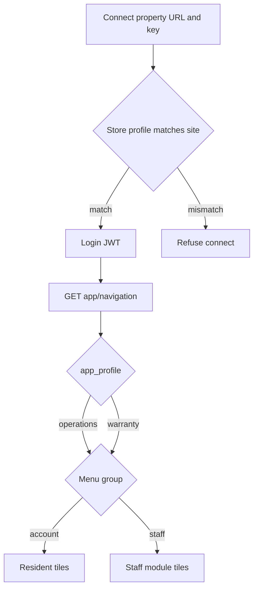
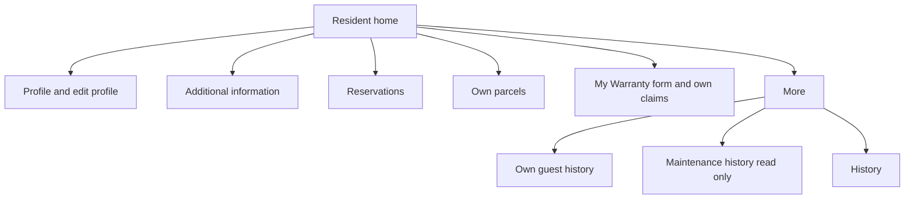
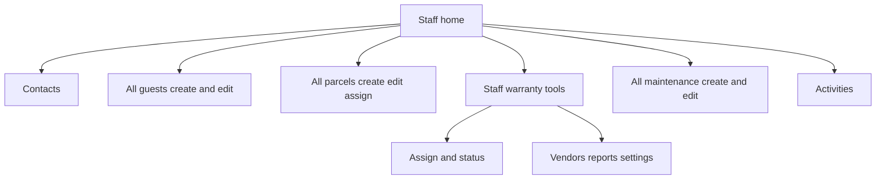
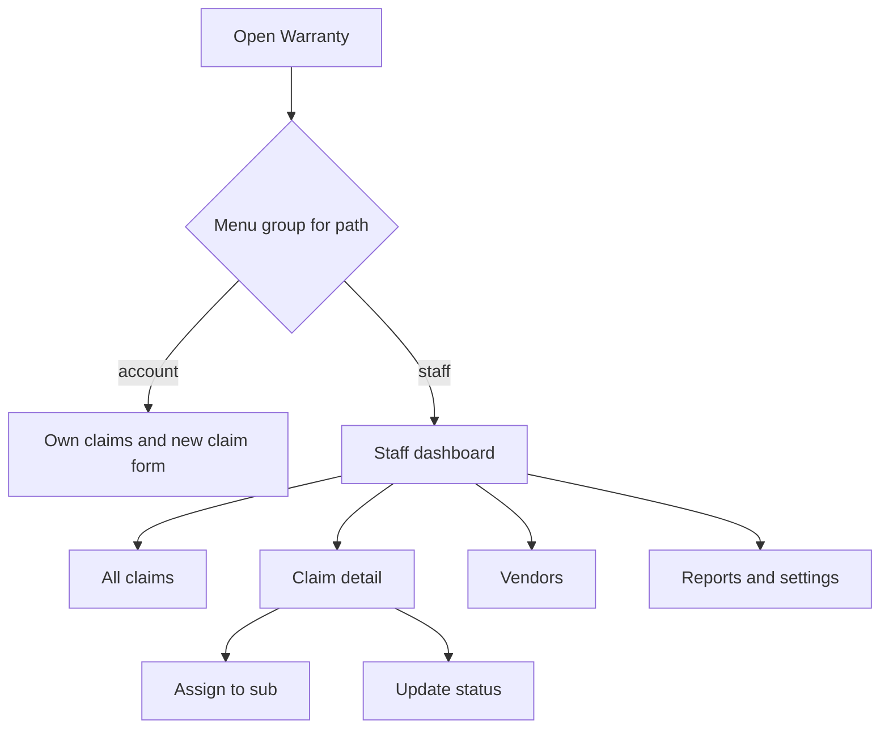
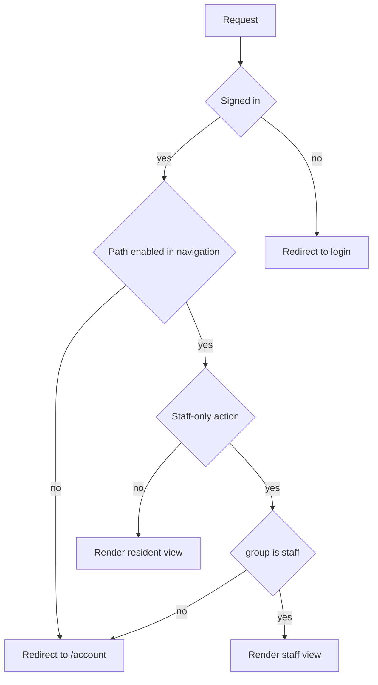

# Mobile app — Admin/Staff vs Resident workflows

Developer reference for this app. Use this when adding a screen, a home tile, or a bottom-nav tab.

This article is the **intended** split: what Admin/Staff can open, and what Residents can open. The last section lists places where the current code still mixes those views. Treat that list as bugs. Do not copy those screens as the spec.

Desktop portals stay in [Residents Portal](../../docs/Residents-Portal.MD), [Client Administrator](../../docs/knowledge-base/Client%20Administrator.MD), and [CE OneSource App Workflow](../../docs/knowledge-base/CE-OneSource-App-Workflow.MD). This article covers the mobile app only.

## Two axes

Keep these separate. A warranty **product** is not the same thing as a staff **role**.

### Product (`operations` or `warranty`)

Defined in `lib/app-profile.ts`.

| Profile | Store name | Native entry | Who may connect |
|---------|------------|--------------|-----------------|
| `operations` | CE OneSource Operations | `/go/operations` | Sites that are not on the warranty plan |
| `warranty` | ClaimTrack | `/go/warranty` | Warranty-plan sites only |

A warranty build hides these paths (`WARRANTY_BLOCKED_PATHS`): parcels, maintenance, guests, contacts, activities, reservations, messaging.

Warranty menu ids that stay available: `warranties`, `profile`, `edit_profile`, `additional_info`, `history` (`WARRANTY_MENU_ALLOWLIST`).

The wrong store app is refused at Connect. Product lock is a cookie (`ceo_app_profile`), set from `/go/operations`, `/go/warranty`, or `NEXT_PUBLIC_APP_PROFILE`.

### Role (staff menus or resident menus)

WordPress `GET /wp-json/onesource/v1/app/navigation` builds the menu. Source: `wp-content/themes/dayone-intranet-sub/inc/rest/app/class-ceo-app-navigation.php` (sibling of this app under `app/public`).

Next.js does not read JWT role names to decide the UI. It reads each menu item's `group`.

| `group` | Who receives it | How Next.js detects it |
|---------|-----------------|------------------------|
| `staff` | `staff_user`, `building_admin`, `client_admin`, `administrator` | Any enabled menu with `group === "staff"` (`HomeScreen.tsx`, `BottomNav.tsx`). Staff actions use `isStaffMenuPath()` in `lib/server-nav.ts`. |
| `account` | `resident_user` when the account is not also staff | Resident home tile list `RESIDENT_HOME_IDS` |

`CEO_App_Navigation::build()` prefers staff menus whenever `is_staff_app_user()` is true, including when the same account also has `resident_user`. A dual-role user gets the staff home. They do not also get Profile, Edit Profile, or Additional Information on that home.

On mobile, Client Admin, Building Admin, and Staff User are one audience. A tile still hides when that user's staff access flag is off (`parcel_access`, `guest_access`, `warranties_access`, `maintenance_access`, `contacts_access`, `activities_access`). Building Admin and Client Admin bypass those flags. The desktop hierarchy is in [Client Administrator](../../docs/knowledge-base/Client%20Administrator.MD).

`role_primary` and `roles` come back on the navigation payload for display. Do not gate a new screen on those fields.

## How a session reaches a home

1. **Connect** (`/connect`) verifies the property URL and mobile security key.
2. If the session was locked with `/go/operations` or `/go/warranty`, that lock must match the site `app_profile`.
3. **Login** (`/login`) stores JWT cookies.
4. **Home** (`/account`) loads menus from `/app/navigation`, then `applyNavVisibility()` in `lib/navigation.ts` applies the product allowlist.
5. Home tiles come from `homeMenus()` in `components/HomeScreen.tsx`.

## Resident — Operations

Own unit and own records. Residents submit warranty claims and view history. They do not run the property.

**Home tiles** (only when the module is on and the menu item is enabled):

- My Profile (`/account/profile`)
- Edit Profile (`/account/edit`)
- Additional Information (`/account/additional-info`) — pets, vehicles, preferences; submissions can require staff approval
- Reservations (`/account/reservations`)
- Parcels (`/account/parcels`) — parcels for this resident
- My Warranty (`/account/warranties`) — submit a claim and see own claims

**Also on the resident menu when the module is on, usually under More:**

- Guests (`/account/guests`) — this resident's guest history
- Maintenance (`/account/maintenance`) — read-only history. Residents do not create work orders. See [Maintenance](../../docs/knowledge-base/Maintenance.MD).
- History (`/account/history`)

**Bottom nav:** Home (`/account`), Profile, Parcels, then More for the rest. Source: `RESIDENT_IDS` in `components/BottomNav.tsx`.

**Residents do not get:** Contacts, Activities, parcel create/edit, property-wide search, warranty assign, warranty status changes, vendors, reports, or warranty settings.

## Staff / Admin — Operations

Property-wide tools. The staff home lists enabled staff modules. It does not list resident Profile, Edit Profile, or Additional Information.

**Home tiles** when the module is on and the access flag allows it:

- Contacts (`/account/contacts`) — `contacts_access`
- Guests (`/account/guests`) — `guest_access`; create and edit for any unit
- Parcels (`/account/parcels`) — `parcel_access`; property list, create, edit, assign a resident, email the resident
- Warranty (`/account/warranties`) — `warranties_access`; staff ClaimTrack tools (assign, status, vendors)
- Maintenance (`/account/maintenance`) — `maintenance_access`; property list, create, edit, assign staff
- Activities (`/account/activities`) — `activities_access`

**Bottom nav:** Home (`/account`), Parcels, Warranty, Maintenance, then More. Source: `STAFF_IDS` in `components/BottomNav.tsx`.

Parcel create (`/account/parcels/new`) and parcel edit already require `isStaffMenuPath(nav, "/account/parcels")`.

**Current filter, not the spec.** `CEO_App_Navigation::build()` temporarily enables only staff ids `parcels`, `maintenance`, `guests`, and `warranties`. Contacts and Activities are built, then disabled. Messaging is disabled for every role (`$hidden_menu_ids`). When that allowlist is removed, Contacts and Activities return for staff who have the access flags. Do not add them to the resident home to "fill the gap."

## Resident — ClaimTrack

Warranty-plan sites and the ClaimTrack store app. Same resident account rules, smaller menu.

**Home:**

- My Warranty — submit a claim and see own claims (`/account/warranties`, `/account/warranties/new`)
- My Profile
- Edit Profile
- Additional Information
- History

**Bottom nav:** Home, My Warranty, More. Resident ClaimTrack chrome stays on `/account` as Home. It does not switch to the staff tab set (Claims directory, Vendors).

Residents do not open vendors, reports, settings, assign, or status.

## Staff — ClaimTrack

Staff on a warranty-plan site, or staff inside the Warranty module from Operations.

**Screens:**

- Dashboard on `/account/warranties` — metrics, including claims assigned to subs
- All claims (`/account/warranties/claims`)
- Claim detail — assign (`/account/warranties/[id]/assign`) and update status (`/account/warranties/[id]/status`)
- Vendors (`/account/warranties/vendors`)
- Reports (`/account/warranties/reports`)
- Warranty settings (`/account/warranties/settings`)

**Bottom nav** (`WARRANTY_TABS` in `BottomNav.tsx`, `variant="warranty"`):

- Home → `/account/warranties`
- Claims → `/account/warranties/claims`
- Vendors → `/account/warranties/vendors`
- More → reports, settings, and any non-warranty menus still enabled

On a warranty-plan site, WordPress disables every menu id outside `warranties`, `profile`, `edit_profile`, `additional_info`, and `history`. Staff menus do not include profile or additional information, so a staff user on ClaimTrack is left with Warranty plus whatever of those resident ids is absent from `build_staff_menus()`.

## Shared paths must branch on group

These URLs are used by both roles. `requireMenuPath()` only checks that the path is enabled. It does not check `group`. Branch staff actions with `isStaffMenuPath()`.

| Path | Resident (`group: account`) | Staff (`group: staff`) |
|------|-----------------------------|------------------------|
| `/account/parcels` | Own parcels | Property list, create, edit, assign resident |
| `/account/guests` | Own guest history | Property list, create, edit |
| `/account/maintenance` | Read-only history | Property list, create, edit, assign staff |
| `/account/warranties` | Own claims and the new-claim form | Staff dashboard, all claims, assign, status, vendors, reports, settings |

## Gate stack for a new screen

1. `requireAuth()` — JWT session. `app/account/layout.tsx` already does this for every account route.
2. `requireMenuPath(path)` — the path must be an **enabled** menu item after the product filter.
3. If the screen creates a record for someone else, assigns, changes status, opens vendors, reports, settings, or searches across units, also require `isStaffMenuPath(nav, path)`.
4. Hiding a button in the client is not the gate. The page itself must redirect.

A new screen belongs to one group. A resident tile must link to a resident component. A staff tile must link to a staff component. Do not mount `WarrantyHome` (or any staff dashboard) on a route that residents can open.

## Current bleed — do not treat as spec

Resident and staff views currently share `/account/warranties/*`, and several of those pages render the staff UI for every signed-in user.

- `app/account/warranties/page.tsx` always renders `WarrantyHome` (staff dashboard: metrics, assigned-to-subs, reports). Resident home still includes the `warranties` tile via `RESIDENT_HOME_IDS` in `components/HomeScreen.tsx`, so residents land on that dashboard.
- These routes check auth only: `app/account/warranties/claims/page.tsx`, `reports/page.tsx`, `settings/page.tsx`, and `app/account/warranties/[id]/edit/page.tsx`. Assign, status, and vendors call `isStaffMenuPath`. Residents can still open the ungated staff pages.
- `BottomNav` with `variant="warranty"` always shows Claims and Vendors (`WARRANTY_TABS`). It does not check `group`. Residents on a warranty profile get the staff tab set.
- `build_resident_menus()` enables Guests and Maintenance whenever those modules are on (`enabled => true`). Residents then pass `requireMenuPath` into the same list screens staff use.
- `isStaffMenuPath()` returns true when `nav.upstream_blocked` is set (`lib/server-nav.ts`). If the navigation request is blocked, staff actions can appear for a resident session.

Until those are split, new warranty work should still follow the intended matrix above.
